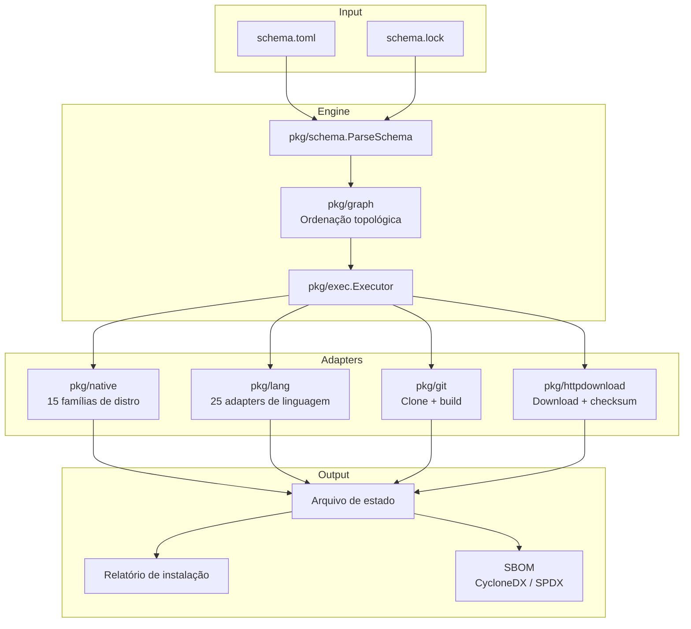
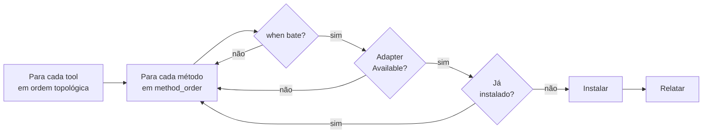

[](README-pt.md)
[](README.md)

<h1 align="center">depengine</h1>

<p align="center">
  <b>Motor distro-agnostic de instalação de dependências</b><br>
  Você descreve <i>o quê</i> instalar — o motor decide <i>como</i>.
</p>

<p align="center">
  <a href="https://github.com/depengine/depengine/actions"></a>
  <a href="https://pkg.go.dev/github.com/depengine/depengine"></a>
  <a href="https://goreportcard.com/report/github.com/depengine/depengine"></a>
  <a href="LICENSE"></a>
  
  
  
  
</p>

---

Escreva um `schema.toml` listando suas ferramentas. O depengine testa cada
método disponível — gerenciador de pacotes nativo, cargo, go, pip, git, http,
flatpak, e mais — até um funcionar. Sem dependências de runtime: binário Go
estático único.

```sh
# Validar seu schema
depengine validate --schema schema.toml

# Instalar tudo
depengine install

# Verificar status
depengine status
```

---

## Quick start

```mermaid
flowchart LR
    A[Escrever schema.toml] --> B[depengine validate]
    B --> C[depengine update]
    C --> D[depengine install]
    D --> E[depengine status]
    E --> F[depengine check &#9989;]
```



```sh
# Build
go build -o depengine .

# Validar o schema de referência
./depengine validate
# → ✓ schema is valid

# Validar com checagem de ambiente (tools no PATH)
./depengine validate --check-env
# → warnings para tools ausentes (normais em dev)

# Instalar todas as dependências
./depengine install

./depengine check nvim
# → Installed

# Saída JSON para scripts
./depengine validate --format=json
./depengine install --json

# Status e remoção
./depengine status                         # lista instalados
./depengine status nvim                    # tool específica
./depengine remove nvim                    # desinstalar

# Resolver placeholders {latest}
./depengine update                         # escreve schema.lock

# Exportar SBOM
./depengine sbom --format cyclonedx        # CycloneDX 1.5
./depengine sbom --format spdx > bom.json  # SPDX 2.3
```
> **Nota:** Compilações para Windows são fornecidas mas **não têm suporte completo**
> — locking de arquivos e gerenciamento de estado não estão implementados no Windows.
> Linux e macOS são os alvos principais.


---

## Schema.toml — o coração declarativo

O schema descreve **tools** (dependências) e **métodos** (como instalá-las).
O motor tenta os métodos na ordem de `method_order` até um funcionar.

### Forma 1 — Tool simples (nome = pacote em toda distro)

```toml
simple = ["zsh", "bat", "kitty", "mpv"]
```

### Forma 2 — Nome do pacote muda por manager nativo

```toml
fd   = { apt = "fd-find" }                # "fd" nos demais
nvim = { pacman = "neovim", apt = "neovim" }
```

### Forma 3 — Manager de linguagem

```toml
organize = { pip = "organize-tool", pipx = "organize-tool" }
fzf      = { go  = "github.com/junegunn/fzf" }
lf       = { go  = "github.com/gokcehan/lf" }
```

> Quando `pkg == tool_name`, use `true` em vez de repetir o nome:
> `ruff = { python = true }` ≡ `ruff = { pipx = "ruff", uv = "ruff" }`.
> Buckets (`python`, `node`) expandem para todos os métodos do ecossistema
> de uma vez (ver Forma 10).

### Forma 4 — cargo/go com git sub-key (não do repositório oficial)

```toml
matugen = { cargo = { git = "https://github.com/InioX/matugen" } }
```

### Forma 5 — Pre-install hook (antes de qualquer método)

```toml
[tools.myenv]
pre_install = "curl -fsSL https://setup.example.com | sh"

  [tools.myenv.native]
  pkg = "my-env"
```

> O hook `pre_install` executa antes do primeiro método — se falhar, a tool é abortada.
> Use com `--allow-arbitrary-code` (aviso de segurança exibido por padrão).

### Forma 6 — Git: clona repo + build manual

```toml
ctpv = { git = { url = "https://github.com/NikitaIvanovV/ctpv", build = "make && sudo make install" } }
```

### Forma 7 — HTTP: baixa artefato (deb, zip, binário)

```toml
fastfetch = { http = {
  url = "https://github.com/fastfetch-cli/fastfetch/releases/download/{latest}/fastfetch-linux-amd64.deb",
  checksum = "sha256:auto"
} }
```

> O campo `checksum` aceita hash literal (`sha256:...`) ou `:auto` (resolução automática).
> Use `checksum_url` para fonte separada, `sudo_required = false` se não precisar de root,
> e `signing_key`/`signature_url` para verificação GPG.

### Forma 8 — Dependência entre tools

```toml
zathura-pdf-mupdf = { requires = ["zathura"], pacman = "zathura-pdf-mupdf" }
```

### Forma 9 — Caso complexo: múltiplos métodos + condição de distro

```toml
[tools.DepartureMono]
postinstall = "fc-cache -fv"

  [tools.DepartureMono.aur]
  pkg  = "otf-departure-mono-nerd"
  when = { distro_family = ["arch"] }

  [tools.DepartureMono.http]
  url        = "https://github.com/ryanoasis/nerd-fonts/releases/download/{latest}/DepartureMono.zip"
  extract_to = "~/.local/share/fonts/DepartureMono"
```

> **Regra de ouro:** Campos de nível de tool (`requires`, `postinstall`, `pre_install`) ficam
> fora do método. Campos específicos do método (`when`, `url`, `build`,
> `checksum`, `extract_to`, `pkg`, `git`) ficam dentro do método.

### Forma 10 — `true` e buckets de ecossistema

Quando o nome do pacote é igual ao nome da tool (~80% dos casos Python/Node),
use `true` em vez de repetir. Buckets expandem para todos os métodos do
ecossistema de uma vez.

**Buckets built-in:**

| Bucket | Expansão | Uso típico |
|--------|----------|------------|
| `python = true` | `{ pip = true, pipx = true, uv = true }` | Ferramentas Python (ruff, httpie, poetry) |
| `node = true` | `{ npm = true, pnpm = true, bun = true }` | Ferramentas Node (prettier, eslint, tsx) |

```toml
ruff = { python = true }        # ≡ { pipx = "ruff", uv = "ruff" }
prettier = { node = true }      # ≡ { npm = "prettier", pnpm = "prettier", bun = "prettier" }
httpie = { python = true }      # pip + pipx + uv (pkg=httpie em todos)
```

> Cada `true` usa o nome da tool como pkg via SubstitutePkg.
> Métodos explícitos NÃO são sobrescritos pelo bucket:
> `organize = { pip = "organize-tool", python = true }` mantém `pip` como
> `"organize-tool"` e expande apenas `pipx`/`uv`.
>
> Buckets só aceitam `true`. `python = false` ou `python = "foo"` não expandem
> (o motor trata como método desconhecido → erro em `validate`).
>
> `all = true` **não existe** — impreciso demais, risco de instalar pacote
> errado de ecossistema diferente.

---

## Editor Support

O projeto publica um [JSON Schema](schema/depengine.schema.json) que descreve a estrutura do `schema.toml`.
Editores com extensão TOML (ex: [taplo](https://taplo.tamasfe.dev/) para VSCode) usam isso para:

- **Autocomplete** de campos (`url:`, `build:`, `checksum:`, `when:`, etc.)
- **Validação inline** de tipos e campos obrigatórios
- **Hover docs** com descrição de cada campo

Para ativar no VSCode com a extensão TOML (taplo), crie na raiz do projeto um `.vscode/settings.json`:

```json
{
  "taplo.schema.enabled": true,
  "taplo.schema.url": "https://raw.githubusercontent.com/depengine/depengine/main/schema/depengine.schema.json"
}
```

Ou, se preferir o schema local:

```json
{
  "taplo.schema.enabled": true,
  "taplo.schema.url": "./schema/depengine.schema.json"
}
```

---

## CLI — comandos e flags

### `depengine install [flags]`

Instala todas as tools do schema, respeitando `method_order`, `when`,
`requires` e ordem topológica.

| Flag | Default | Descrição |
|------|---------|-----------|
| `--schema` | `schema.toml` | Caminho para o schema |
| `--dry-run` | `false` | Mostra o que seria instalado sem executar |
| `--verbose` | `false` | Saída detalhada por tool |
| `--json` | `false` | Saída em JSON |
| `--only <tool>` | — | Instala apenas uma tool específica |
| `--skip <tools>` | — | Pula tools (separadas por vírgula) |
| `--sort-by` | — | Ordena output: `name`, `status`, `method` |
| `--log-level` | `info` | Nível de log: `debug`, `info`, `warn`, `error` |
| `--diagnose` | `false` | Modo diagnóstico: DEBUG + dry-run + verbose |
| `--profile <tag>` | — | Filtra tools por tag (ex: `desktop`, `server`) |
| `--jobs <n>` | `1` | Máximo de instalações simultâneas |
| `--allow-arbitrary-code` | `false` | Suprime avisos de segurança para scripts de build |
| `--frozen-lockfile` | `false` | Aborta se o lockfile não existir |

### `depengine validate [flags]`

Valida o schema e opcionalmente o ambiente.

| Flag | Default | Descrição |
|------|---------|-----------|
| `--schema` | `schema.toml` | Caminho para o schema |
| `--check-env` | `false` | Verifica se as tools necessárias estão no PATH |
| `--format` | `text` | Formato de saída: `text` ou `json` |
| `--strict` | `false` | Warnings viram erros (exit code 1) |

### `depengine check <tool>`

Verifica se uma tool específica está instalada na máquina.

### `depengine status [tool]`

Mostra o estado de instalação de todas as tools ou de uma específica.

| Flag | Default | Descrição |
|------|---------|-----------|
| `--format` | `text` | Formato: `text` ou `json` |
| `--orphans` | `false` | Mostra apenas tools instaladas que não estão no schema |

### `depengine remove <tool>`

Remove uma tool instalada pelo depengine. Apenas tools com suporte a
remoção no adapter (nativas, cargo, pip, etc.) são removidas.

### `depengine update [flags]`

Atualiza o schema.lock resolvendo placeholders `{latest}` via GitHub API.

| Flag | Default | Descrição |
|------|---------|-----------|
| `--schema` | `schema.toml` | Caminho para o schema |
| `--lock` | `schema.lock` | Caminho para o lockfile |
| `--profile <tag>` | — | Filtra tools por tag (ex: `desktop`, `server`) |
| `--frozen-lockfile` | `false` | Aborta se schema.lock não existir |
| `--dry-run` | `false` | Mostra o que seria atualizado sem escrever |
| `-v` | `false` | Saída detalhada |

### `depengine graph [flags]`

Mostra o grafo de dependência como texto, Mermaid ou DOT.

| Flag | Default | Descrição |
|------|---------|-----------|
| `--format` | `text` | Formato: `text`, `mermaid` ou `dot` |
| `--only <tool>` | — | Mostra apenas o subgrafo de uma tool |
| `--skip <tools>` | — | Pula tools do grafo (separadas por vírgula) |
| `--profile <tag>` | — | Filtra tools por tag |

### `depengine why <tool>`

Explica como uma tool seria instalada, método por método.

| Flag | Default | Descrição |
|------|---------|-----------|
| `--json` | `false` | Saída em JSON |

### `depengine forget <tool>`

Remove uma tool do estado sem tocar no sistema.

### `depengine undo [flags]`

Reverte a última instalação.

| Flag | Default | Descrição |
|------|---------|-----------|
| `--list` | `false` | Lista snapshots disponíveis |
| `--snapshot <path>` | — | Reverte para um snapshot específico |

### `depengine diff [flags]`

Compara dois arquivos de estado.

| Flag | Default | Descrição |
|------|---------|-----------|
| `--other <path>` | — | Segundo arquivo de estado |

### `depengine completion <shell>`

Gera script de completação para o shell. Shells: `bash`, `zsh`, `fish`.

### `depengine sbom [flags]`

Exporta SBOM (Software Bill of Materials) no formato CycloneDX 1.5 ou SPDX 2.3.

| Flag | Default | Descrição |
|------|---------|-----------|
| `--format` | `cyclonedx` | Formato: `cyclonedx` ou `spdx` |

### Exit codes

| Código | Significado |
|--------|-------------|
| `0` | Sucesso |
| `1` | Alguma ferramenta falhou / strict mode com warnings |
| `2` | Erro de schema (TOML inválido, validação) |
| `3` | Erro de runtime (`detect_os.sh` não encontrado, etc.) |

---

## Métodos de instalação suportados (28)

| Categoria | Métodos |
|-----------|---------|
| **Nativo** | `native` (auto-detecta apt/pacman/dnf/brew/...) + aliases por manager |
| **Linguagem** | `cargo`, `go`, `pip`, `pipx`, `uv`, `npm`, `pnpm`, `bun`, `gem`, `yarn`, `yarn-berry`, `composer`, `apm` |
| **Desktop** | `flatpak`, `snap`, `vscode`, `vscodium`, `cask` (macOS), `mas` (Mac App Store) |
| **Especializados** | `sdkman`, `steamcmd`, `pacstall`, `aur` (com helper configurável), `conda`, `asdf` |
| **Outros** | `git` (clone + build), `http` (download + extração + checksum) |

Managers nativos detectados automaticamente (15 distros, ~27 managers):

```
debian  → apt        fedora → dnf      suse   → zypper    arch     → pacman
alpine  → apk        void   → xbps     gentoo → emerge    macos    → brew
termux  → pkg        freebsd → pkg     openbsd → pkg_add  netbsd   → pkg
mint    → apt        opkg   → opkg
```

---

## Arquitetura



### Camadas

| Pacote | Responsabilidade |
|--------|------------------|
| `pkg/run` | Interface `Runner` — seam único para subprocessos. Produção: `OSExecRunner`. Testes: `FakeRunner`. |
| `pkg/engine` | Invoca `detect_os.sh`, faz parse do JSON → `Facts`, resolve clan via `ResolveFamily` (15 clans) |
| `pkg/native` | Registro declarativo de 15 distros. Manager lookup, build de comandos de instalação |
| `pkg/schema` | Parser TOML (3 formas de declaração) + expansão de placeholders + validação de kinds |
| `pkg/exec` | Executor central + interface `Adapter` + registro + sync manager + reports |
| `pkg/lang` | 25 adapters de linguagem/ecossistema (BaseAdapter genérico + especializados) |
| `pkg/git` | GitAdapter: clone shallow + build |
| `pkg/httpdownload` | HTTPAdapter: download + extração + checksum SHA256 + resolução de `{latest}` |
| `pkg/graph` | Ordenação topológica (Kahn) com detecção de ciclos |
| `pkg/log` | Logger estruturado via `log/slog` com trace ID, níveis DEBUG–ERROR |
| `pkg/validate` | Validação estrutural + semântica + ambiental (CLI `validate`) |

### Fluxo de instalação



---

## Placeholders

O schema suporta placeholders que são resolvidos antes da instalação:

| Placeholder | Origem | Exemplo |
|-------------|--------|---------|
| `{arch}` | `detect_os.sh` | `x86_64`, `aarch64` |
| `{os}` | `detect_os.sh` | `linux`, `darwin` |
| `{distro_family}` | `ResolveFamily` | `debian`, `arch`, `fedora` |
| `{kernel}` | `detect_os.sh` | `5.15.0` |
| `{libc}` | `detect_os.sh` | `glibc`, `musl` |
| `{init_system}` | `detect_os.sh` | `systemd`, `openrc` |
| `{pkg}` | Substituído pelo adapter no momento da instalação | nome do pacote |
| `{latest}` | Resolvido via GitHub API (adapters git/http) | `v1.2.3` |

Placeholders desconhecidos são flagados pela validação (`depengine validate`).

---

## Variáveis de ambiente

| Variável | Efeito |
|----------|--------|
| `DEPENGINE_DETECT_SCRIPT` | Caminho para `detect_os.sh` (default: ao lado do binário) |
| `DEPENGINE_TRACE_ID` | ID de rastreamento propagado a subprocessos |
| `DEPENGINE_LOG_JSON` | `=1` ativa saída JSON do logger |

---

## Desenvolvimento

```sh
go test ./...                    # 18 packages, 100+ testes
go vet ./...                     # análise estática
go build -o depengine .          # build
./depengine validate --schema schema.toml --check-env --format=json
```

### Testes de integração (Docker)

```sh
cd tests/integration
docker compose up --build
# Testa install/validate em Debian, Arch, Fedora e Alpine
```

---

## Licença

[GNU General Public License v3 ou posterior](LICENSE)
