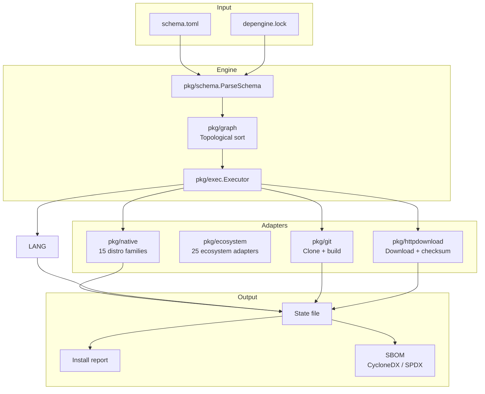
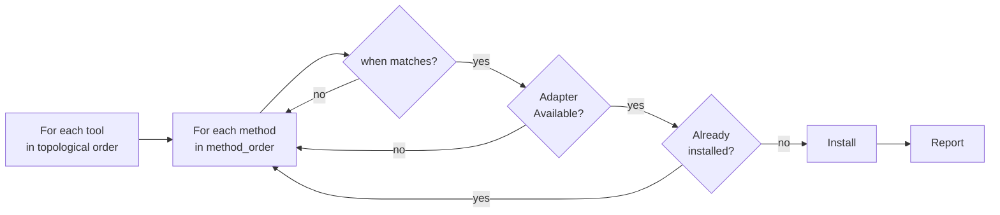

[](README-pt.md)
[](README.md)

<h1 align="center">depengine</h1>

<p align="center">
  <b>Distro-agnostic dependency installer</b><br>
  Declare <i>what</i> to install — the engine figures out <i>how</i>.
</p>

<p align="center">
  <a href="https://github.com/Khorea1/depengine/actions"></a>
  <a href="https://pkg.go.dev/github.com/Khorea1/depengine"></a>
  <a href="https://goreportcard.com/report/github.com/Khorea1/depengine"></a>
  <a href="LICENSE"></a>
  
  
  
  
</p>

---

Write a `schema.toml` listing your tools. depengine tests every available
method — native package manager, cargo, go, pip, git, http, flatpak, and more —
until one succeeds. No runtime dependencies: single static Go binary.

```sh
# Validate your schema
depengine validate --schema schema.toml

# Install everything
depengine install

# Check status
depengine status
```

---

> **Note:** Windows builds are provided but **not fully supported** — file locking
> and state management are not implemented on Windows. Linux and macOS are the
> primary targets.
>
> ## Quick start — the sharing workflow
>
> depengine works like a `requirements.txt` or `package.json` for system tools.
> Write a `schema.toml`, commit it, and everyone gets the same tools.
>
> ```mermaid
> flowchart LR
>     A[Write schema.toml] --> B[depengine install]
>     B --> C[depengine status ✓]
>     D[git clone] --> E[depengine install]
> ```
>
> ```sh
> # --- PROJECT AUTHOR: define what to install ---
> depengine init --add "zsh,bat,nvim,ruff"
> # → ✓ depengine.toml created with 4 tools
>
> # Validate the schema
> ./depengine validate
> # → ✓ schema is valid
>
> # Install everything (auto-resolves {latest} if no lockfile exists)
> ./depengine install
> # → 4 installed, 0 failed
>
> # Check individual tools
> ./depengine check nvim
> # → Installed
>
> # Commit the schema and lock so others can reproduce:
> #   git add depengine.toml depengine.lock && git commit
>
>
> # --- OTHER DEVELOPER: clone and install ---
> git clone <project>
> cd <project>
> depengine install
> # → same tools, same versions
>
>
> # --- ADVANCED: pin versions explicitly (optional) ---
> ./depengine update
> # → writes depengine.lock with pinned versions
> ./depengine install --frozen-lockfile
> # → only installs pinned versions
>
> # Structured output for scripts
> ./depengine validate --format=json
> ./depengine install --json
>
>
> # Status and removal
> ./depengine status                         # list installed
> ./depengine status nvim                    # specific tool
> ./depengine remove nvim                    # uninstall
>
> # Resolve {latest} placeholders
> ./depengine update                         # writes depengine.lock
>
> # Export SBOM
> ./depengine sbom --format cyclonedx        # CycloneDX 1.5
> ./depengine sbom --format spdx > bom.json  # SPDX 2.3
> ```


---

## schema.toml vs manifest.toml

Two files work together:

| File | Location | Purpose | Shared? |
|------|----------|---------|---------|
| `schema.toml` | Project root | **What** to install — the shared dependency list | Yes, commit to git |
| `manifest.toml` | `~/.config/depengine/manifest.toml` | **How** to install — personal package name overrides | No, per-machine |

### Merge behavior (when both files define the same tool name)

The engine merges layers by **whole-tool overwrite** (not field-by-field):

1. **Whole-tool overwrite**: When schema and manifest both define the same tool name, the schema's *entire* tool entry replaces the manifest's — methods, pkg settings, everything. Nothing is merged field-by-field.
2. **Tools only in manifest**: These ARE included — the manifest can add tools not present in the schema.
3. **Tools only in schema**: Included as always.
4. **Defaults**: Always from the schema. Any `[defaults]` in the manifest is ignored.
5. **Fields NOT allowed in manifest**: `pre_install`, `postinstall`/`post_install`, `requires`, `tags` are rejected by `ValidateManifestLayer` and cause an error. Only set these in your project's `schema.toml`.

> Most users never need a manifest. Start with just `schema.toml`. Add a manifest only when the package name differs on your distro (e.g. `apt install fd-find` vs `pacman -S fd`).

---
## schema.toml — the declarative heart

A schema describes **tools** (dependencies) and **methods** (how to install).
The engine tries methods in `method_order` until one works.

### Form 1 — Simple tool (name = package across all distros)

```toml
simple = ["zsh", "bat", "kitty", "mpv"]
```

### Form 2 — Package name varies per native manager

```toml
fd   = { apt = "fd-find" }                 # "fd" on all others
nvim = { pacman = "neovim", apt = "neovim" }
```

### Form 3 — Language ecosystem managers

```toml
organize = { pip = "organize-tool", pipx = "organize-tool" }
fzf      = { go  = "github.com/junegunn/fzf" }
lf       = { go  = "github.com/gokcehan/lf" }
```

> When `pkg == tool_name`, use `true` instead of repeating:
> `ruff = { python = true }` ≡ `ruff = { pipx = "ruff", uv = "ruff" }`.
> Buckets (`python`, `node`) expand to all methods in that ecosystem at once
> (see Form 11 below).

### Form 4 — cargo/go with custom git source (not the official repo)

```toml
matugen = { cargo = { git = "https://github.com/InioX/matugen" } }
```

### Form 5 — Pre-install hook (before any method)

```toml
[tools.myenv]
pre_install = "curl -fsSL https://setup.example.com | sh"

  [tools.myenv.native]
  pkg = "my-env"
```

> `pre_install` runs before the first method — if it fails, the tool is aborted.
> Requires `--allow-arbitrary-code` (security warning shown by default).

### Form 6 — Git: clone + manual build

```toml
ctpv = { git = { url = "https://github.com/NikitaIvanovV/ctpv", build = "make && sudo make install" } }
```

### Form 7 — HTTP: download artifact (deb, zip, binary)

```toml
fastfetch = { http = {
  url = "https://github.com/fastfetch-cli/fastfetch/releases/download/{latest}/fastfetch-linux-amd64.deb",
  checksum = "sha256:auto"
} }
```

> `checksum` accepts a literal hash (`sha256:...`) or `:auto` (automatic resolution).
> Use `checksum_url` for a separate source, `sudo_required = false` if root isn't needed,
> and `signing_key`/`signature_url` for GPG verification.

### Form 8 — Tool-to-tool dependency

```toml
zathura-pdf-mupdf = { requires = ["zathura"], pacman = "zathura-pdf-mupdf" }
```

### Form 9 — Complex case: multiple methods + distro condition

```toml
[tools.DepartureMono]
postinstall = "fc-cache -fv"

  [tools.DepartureMono.aur]
  pkg  = "otf-departure-mono-nerd"
  when = { distro_family = ["arch"] }

  [tools.DepartureMono.http]
  url        = "https://github.com/ryanoasis/nerd-fonts/releases/download/{latest}/DepartureMono.zip"
  extract_to = "~/.local/share/fonts/DepartureMono"
```

> **Golden rule:** Tool-level fields (`requires`, `postinstall`, `pre_install`) go
> _outside_ the method block. Method-specific fields (`when`, `url`, `build`,
> `checksum`, `extract_to`, `pkg`, `git`) go _inside_.


---

### Form 10 — Platform conditions (`when`) — multi-dimension gating

A method's `when` clause can specify **multiple platform dimensions**.
The engine evaluates all non-empty fields against the detected system facts
(**AND** semantics: every field must match). Within each field, any value
suffices (**OR** semantics).

This lets you gate a method on architecture, libc, OS, kernel, init system,
WSL/container status, distro ID, or resolved distro family — in any
combination.

**Available condition fields:**

| Field | Type | Comparison | Values from `detect_os.sh` |
|-------|------|------------|---------------------------|
| `distro_family` | `string[]` | Exact match (case-insensitive) | `arch`, `debian`, `fedora`, `alpine`, `gentoo`, `macos`, `freebsd`, … |
| `distro_id` | `string[]` | Exact match (case-insensitive) | `ubuntu`, `arch`, `fedora`, `debian`, `alpine`, … |
| `arch` | `string[]` | Exact match (case-insensitive) | `x86_64`, `aarch64`, `armv7l`, … |
| `os` | `string[]` | Exact match (case-insensitive) | `linux`, `darwin`, `windows`, `freebsd`, `openbsd`, `netbsd` |
| `kernel` | `string[]` | Exact match (case-insensitive) | `6.7.0-arch`, `5.15.0-generic`, … |
| `libc` | `string[]` | **Prefix** match | `glibc` matches `glibc 2.35`; `musl` for Alpine |
| `init_system` | `string[]` | Exact match (case-insensitive) | `systemd`, `openrc`, `runit`, `sysvinit` |
| `is_wsl` | `bool` | Three-state (true/false/omit) | Detected via `/proc/version` or `WSL_DISTRO_NAME` |
| `is_container` | `bool` | Three-state (true/false/omit) | Detected via `.dockerenv`, cgroup, etc. |

**Semantics:**

1. **AND between fields** — if you specify `arch` + `libc` + `os`, all three must match.
2. **OR within each field** — `arch: ["x86_64", "aarch64"]` is satisfied by either.
3. **Empty fields are ignored** — a condition with only `arch` set doesn't care about libc.
4. **Nil / absent `when` always matches** — methods without `when` are always tried.
5. **`distro_family`** is the resolved *clan* (e.g. Ubuntu → `debian`), not the raw distro ID.
   Use `distro_id` for exact distro matching.

**Real examples:**

```toml
# AUR only on Arch, HTTP fallback everywhere else
[tools.DepartureMono]
postinstall = "fc-cache -fv"

  [tools.DepartureMono.aur]
  pkg  = "otf-departure-mono-nerd"
  when = { distro_family = ["arch"] }

  [tools.DepartureMono.http]
  url        = "https://github.com/ryanoasis/nerd-fonts/releases/download/{latest}/DepartureMono.zip"
  extract_to = "~/.local/share/fonts/DepartureMono"
```

```toml
# Different binary per architecture + libc combination
[tools.restic]
  [tools.restic.http]
  url = "https://github.com/restic/restic/releases/download/{latest}/restic_{latest}_linux_{arch}.bz2"
  when = { arch = ["x86_64", "aarch64"], os = ["linux"], libc = ["glibc"] }

  [tools.restic.http-musl]
  url = "https://github.com/restic/restic/releases/download/{latest}/restic_{latest}_linux_{arch}_musl.bz2"
  when = { arch = ["x86_64", "aarch64"], os = ["linux"], libc = ["musl"] }
```

```toml
# WSL-specific install
[tools.podman]
  [tools.podman.native]
  when = { is_wsl = false }

  [tools.podman.http]
  url = "https://github.com/containers/podman/releases/download/{latest}/podman-wsl-{arch}.zip"
  when = { is_wsl = true }
```

```toml
# Container-aware: skip native in containers, use static binary
[tools.neovim]
  [tools.neovim.native]
  when = { is_container = false }

  [tools.neovim.http]
  url = "https://github.com/neovim/neovim/releases/download/stable/nvim-linux-{arch}.tar.gz"
  extract_to = "~/.local/bin"
  when = { is_container = true, arch = ["x86_64", "aarch64"] }
```

```toml
# Kernel-specific DKMS package
[tools.v4l2loopback]
  [tools.v4l2loopback.aur]
  pkg = "v4l2loopback-dkms"
  when = { distro_family = ["arch"], kernel = ["6.7", "6.8", "6.9"] }
```

> **Tip:** Use `depengine why <tool>` to see which method applies on your
> current machine and why others are skipped (`skip_when`).

The condition system matches **system facts detected at runtime** by
`detect_os.sh`. All fields mirror its JSON output exactly. Facts are gathered
once per `depengine install` run and cached in the `Executor`.

---

### Form 11 — `true` shorthand and ecosystem buckets

When the package name equals the tool name (~80% of Python/Node cases),
use `true` instead of repeating. Buckets expand to all methods in the ecosystem.

**Built-in buckets:**

| Bucket | Expansion | Typical use |
|--------|-----------|-------------|
| `python = true` | `{ pip = true, pipx = true, uv = true }` | Python tools (ruff, httpie, poetry) |
| `node = true` | `{ npm = true, pnpm = true, bun = true }` | Node tools (prettier, eslint, tsx) |

```toml
ruff = { python = true }        # ≡ { pipx = "ruff", uv = "ruff" }
prettier = { node = true }      # ≡ { npm = "prettier", pnpm = "prettier", bun = "prettier" }
httpie = { python = true }      # pip + pipx + uv (pkg=httpie on all)
```

> Each `true` uses the tool name as pkg via SubstitutePkg.
> Explicit methods are NOT overridden by the bucket:
> `organize = { pip = "organize-tool", python = true }` keeps `pip` as
> `"organize-tool"` and only expands `pipx`/`uv`.
>
> Buckets also accept a **package name string** or a **config map**, expanding to
> all methods in the ecosystem with that value:
>
> ```toml
> organize = { python = "organize-tool" }
> # ≡ { pip = "organize-tool", pipx = "organize-tool", uv = "organize-tool" }
>
> # With extra config shared across all expanded methods:
> organize = { python = { pkg = "organize-tool", when = { distro_family = ["arch"] } } }
> ```
>
> `python = false` won't expand (the engine treats `python` as an unknown method
> → error on `validate`).
>
> `all = true` **does not exist** — too imprecise, risks installing the wrong
> package from a different ecosystem.

---

### Per-tool method control

Override the method order for a single tool with `method_prefer` (prefix) or
`method_only` (exclusive list):

```toml
# Try cargo first, fall back to the default order:
myapp = { method_prefer = ["cargo"], cargo = true }

# Only use these methods, in this order — no fallback:
legacy = { method_only = ["aur", "git"], aur = { pkg = "legacy" }, git = { url = "..." } }
```

- **`method_prefer`**: prepends the listed methods before the global `method_order`. Methods not in the list are still tried as fallbacks.
- **`method_only`**: restricts the tool to exactly these methods, in this order. Global `method_order` is ignored for this tool.
- **`method_order`** (deprecated): old name for `method_prefer`. Still works but logs a warning.
- These fields live at tool level (same level as `requires`, `tags`, `postinstall`), not inside a method block.

---
## Editor support

A [JSON Schema](schema/depengine.schema.json) describes the `schema.toml` structure.
Editors with TOML extensions (e.g. [taplo](https://taplo.tamasfe.dev/) for VSCode) use it for:

- **Autocomplete** of fields (`url:`, `build:`, `checksum:`, `when:`, etc.)
- **Inline validation** of types and required fields
- **Hover docs** with field descriptions

Enable it in `.vscode/settings.json`:

```json
{
  "taplo.schema.enabled": true,
  "taplo.schema.url": "https://raw.githubusercontent.com/Khorea1/depengine/main/schema/depengine.schema.json"
}
```

Or use the local schema:

```json
{
  "taplo.schema.enabled": true,
  "taplo.schema.url": "./schema/depengine.schema.json"
}
```

---

### `depengine init [flags]`

Creates a new `depengine.toml` (or custom path). Fails if the file already exists.

| Flag | Default | Description |
|------|---------|-------------|
| `--schema <path>` | `depengine.toml` | Path to write the schema file |
| `--add <tools>` | — | Comma-separated tool names to pre-populate (e.g. `--add "zsh,bat,nvim"`) |

```sh
depengine init                          # creates depengine.toml with template
depengine init --add "zsh,bat,nvim"     # creates depengine.toml with 3 simple tools
depengine init --schema tools.toml --add "ruff,prettier"  # custom filename
```

After init, share the file with your team so everyone installs the same tools.

## CLI reference

### `depengine install [flags]`

Installs all tools from the schema, respecting `method_order`, `when`,
`requires`, and topological ordering.

| Flag | Default | Description |
|------|---------|-------------|
| `--schema` | `depengine.toml` | Path to schema file (auto-detected: depengine.toml, schema.toml, depends.toml) |
| `--dry-run` | `false` | Show what would be installed |
| `--verbose` | `false` | Detailed output per tool |
| `--json` | `false` | JSON output |
| `--only <tool>` | — | Install a single tool |
| `--skip <tools>` | — | Skip comma-separated tools |
| `--sort-by` | — | Sort output: `name`, `status`, `method` |
| `--log-level` | `info` | Log level: `debug`, `info`, `warn`, `error` |
| `--diagnose` | `false` | Diagnostic mode: DEBUG + dry-run + verbose |
| `--profile <tag>` | — | Filter tools by tag (e.g. `desktop`, `server`) |
| `--jobs <n>` | `1` | Max concurrent installations |
| `--allow-arbitrary-code` | `false` | Suppress build script security warnings |
| `--frozen-lockfile` | `false` | Abort if lockfile doesn't exist |
| `--manifest <path>` | auto (XDG_CONFIG_HOME) | Path to personal manifest |
| `--no-manifest` | `false` | Disable personal manifest |
| `--quiet` | `false` | Suppress non-essential output |

### `depengine validate [flags]`

Validates the schema and optionally the environment.

| Flag | Default | Description |
|------|---------|-------------|
| `--schema` | `depengine.toml` | Path to schema (auto-detected: depengine.toml, schema.toml, depends.toml) |
| `--check-env` | `false` | Check required tools are on PATH |
| `--format` | `text` | Output format: `text` or `json` |
| `--strict` | `false` | Warnings become errors (exit code 1) |
| `--manifest <path>` | auto (XDG_CONFIG_HOME) | Path to personal manifest |
| `--no-manifest` | `false` | Disable personal manifest |

### `depengine check <tool> [flags]`

Checks whether a specific tool is installed.

| Flag | Default | Description |
|------|---------|-------------|
| `--manifest <path>` | auto (XDG_CONFIG_HOME) | Path to personal manifest |
| `--no-manifest` | `false` | Disable personal manifest |
| `--live` | `false` | Check live system instead of state file |
| `--format` | `text` | Output format: `text` or `json` |

### `depengine status [tool]`

Shows installation state of all tools or a specific one.

| Flag | Default | Description |
|------|---------|-------------|
| `--format` | `text` | Format: `text` or `json` |
| `--orphans` | `false` | Show only installed tools not in schema |
| `--manifest <path>` | auto (XDG_CONFIG_HOME) | Path to personal manifest |
| `--no-manifest` | `false` | Disable personal manifest |

### `depengine remove <tool> [flags]`

Removes a tool installed by depengine (native, cargo, pip, etc.).

| Flag | Default | Description |
|------|---------|-------------|
| `--all` | `false` | Remove all tracked tools |
| `--dry-run` | `false` | Show what would be removed without executing |
| `--force` | `false` | Skip confirmation when removing all tools |
| `--only <tool>` | — | Remove a specific tool (alternative to positional argument) |

### `depengine update [flags]`

Updates `depengine.lock` by resolving `{latest}` via GitHub API.

| Flag | Default | Description |
|------|---------|-------------|
| `--schema` | `depengine.toml` | Path to schema (auto-detected: depengine.toml, schema.toml, depends.toml) |
| `--lock` | `depengine.lock` | Path to lockfile |
| `--profile <tag>` | — | Filter tools by tag |
| `--frozen-lockfile` | `false` | Abort if depengine.lock doesn't exist |
| `--dry-run` | `false` | Show what would be updated |
| `-v` | `false` | Verbose output |
| `--manifest <path>` | auto (XDG_CONFIG_HOME) | Path to personal manifest |
| `--no-manifest` | `false` | Disable personal manifest |

### `depengine graph [flags]`

Shows the dependency graph as text, Mermaid, or DOT.

| Flag | Default | Description |
|------|---------|-------------|
| `--format` | `text` | Format: `text`, `mermaid` or `dot` |
| `--only <tool>` | — | Subgraph for one tool |
| `--skip <tools>` | — | Comma-separated tools to skip |
| `--profile <tag>` | — | Filter by tag |
| `--manifest <path>` | auto (XDG_CONFIG_HOME) | Path to personal manifest |
| `--no-manifest` | `false` | Disable personal manifest |

### `depengine why <tool>`

Explains how a tool would be installed, method by method.

| Flag | Default | Description |
|------|---------|-------------|
| `--json` | `false` | JSON output |
| `--format` | `text` | Output format: `text` or `json` |

### `depengine forget <tool>`

Removes a tool from state without touching the system.

### `depengine undo [flags]`

Reverts the last installation.

| Flag | Default | Description |
|------|---------|-------------|
| `--list` | `false` | List available snapshots |
| `--snapshot <path>` | — | Revert to a specific snapshot |

### `depengine diff [flags]`

Compares two state files.

| Flag | Default | Description |
|------|---------|-------------|
| `--other <path>` | — | Second state file |
| `--json` | `false` | Output differences as JSON |

### `depengine completion <shell>`

Generates shell completion scripts. Shells: `bash`, `zsh`, `fish`.

### `depengine sbom [flags]`

Exports an SBOM in CycloneDX 1.5 or SPDX 2.3 format.

| Flag | Default | Description |
|------|---------|-------------|
| `--format` | `cyclonedx` | Format: `cyclonedx` or `spdx` |

### `depengine help [command]`

Shows help for depengine or a specific command. Use \`depengine help --man\` to display the man page.

### Exit codes

| Code | Meaning |
|------|---------|
| `0` | Success |
| `1` | Tool failure / strict mode warnings |
| `2` | Schema error (invalid TOML, validation) |
| `3` | Runtime error (`detect_os.sh` not found, etc.) |

---

## Supported installation methods (30)

| Category | Methods |
|----------|---------|
| **Native** | `native` (auto-detects apt/pacman/dnf/brew/...) + per-manager aliases |
| **Language** | `cargo`, `go`, `pip`, `pipx`, `uv`, `npm`, `pnpm`, `bun`, `gem`, `yarn`, `yarn-berry`, `composer`, `apm` |
| **Desktop** | `flatpak`, `snap`, `vscode`, `vscodium`, `cask` (macOS), `mas` (Mac App Store) |
| **Windows** | `scoop`, `choco` |
| **Specialized** | `sdkman`, `steamcmd`, `pacstall`, `aur` (configurable helper), `conda`, `asdf` |
| **Other** | `git` (clone + build), `http` (download + extract + checksum) |

Auto-detected native managers (15 distro families, ~27 managers):

```
debian  → apt        fedora → dnf      suse   → zypper    arch     → pacman
alpine  → apk        void   → xbps     gentoo → emerge    macos    → brew
termux  → pkg        freebsd → pkg     openbsd → pkg_add  netbsd   → pkg
mint    → apt        opkg   → opkg
```

---

## Architecture



### Package layers

| Package | Responsibility |
|---------|----------------|
| `pkg/run` | `Runner` interface — seam for subprocess. Production: `OSExecRunner`. Tests: `FakeRunner`. |
| `pkg/engine` | Invokes `detect_os.sh`, parses JSON → `Facts`, resolves clan via `ResolveFamily` (15 clans) |
| `pkg/native` | Declarative registry of 15 distros. Manager lookup, install command building |
| `pkg/schema` | TOML parser (3 declaration forms) + placeholder expansion + kind validation |
| `pkg/exec` | Central executor + `Adapter` interface + registry + sync manager + reports |
| `pkg/ecosystem` | 25 ecosystem adapters (generic `BaseAdapter` + specialized) |
| `pkg/git` | GitAdapter: shallow clone + build |
| `pkg/httpdownload` | HTTPAdapter: download + extraction + SHA256 + `{latest}` resolution |
| `pkg/graph` | Topological sort (Kahn) with cycle detection |
| `pkg/log` | Structured logger via `log/slog` with trace ID, DEBUG–ERROR levels |
| `pkg/validate` | Structural + semantic + environmental validation |

### Installation flow



---

## Placeholders

The schema supports placeholders resolved before installation:

| Placeholder | Source | Example |
|-------------|--------|---------|
| `{arch}` | `detect_os.sh` | `x86_64`, `aarch64` |
| `{os}` | `detect_os.sh` | `linux`, `darwin` |
| `{distro_family}` | `ResolveFamily` | `debian`, `arch`, `fedora` |
| `{kernel}` | `detect_os.sh` | `5.15.0` |
| `{libc}` | `detect_os.sh` | `glibc`, `musl` |
| `{init_system}` | `detect_os.sh` | `systemd`, `openrc` |
| `{pkg}` | Substituted by adapter at install time | package name |
| `{latest}` | Resolved via GitHub API (git/http adapters) | `v1.2.3` |

Unknown placeholders are flagged by validation (`depengine validate`).

---

## Environment variables

| Variable | Effect |
|----------|--------|
| `DEPENGINE_DETECT_SCRIPT` | Path to `detect_os.sh` (default: next to the binary) |
| `DEPENGINE_TRACE_ID` | Trace ID propagated to subprocesses |
| `DEPENGINE_LOG_JSON` | `=1` enables JSON log output |

---

## Development

```sh
go test ./...                    # 18 packages, 100+ tests
go vet ./...                     # static analysis
go build -o depengine .          # build
./depengine validate --schema schema.toml --check-env --format=json
```

### Integration tests (Docker)

```sh
cd tests/integration
docker compose up --build
# Tests install/validate on Debian, Arch, Fedora, and Alpine
```

---

## License

[GNU General Public License v3 or later](LICENSE)
