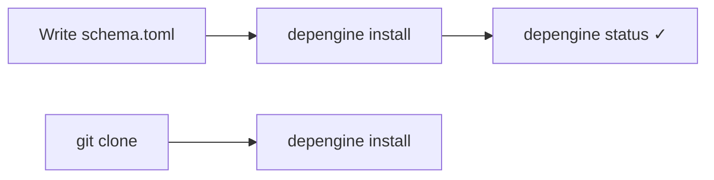

<h1 align="center">depengine</h1>

<p align="center">
  <b>Distro-agnostic dependency installer</b><br>
  Declare <i>what</i> to install — the engine figures out <i>how</i>.
</p>

<p align="center">
  <a href="https://github.com/Khorea1/depengine/actions"></a>
  <a href="https://goreportcard.com/report/github.com/Khorea1/depengine"></a>
  <a href="LICENSE"></a>
  
</p>

---

Write a `schema.toml` listing your tools. depengine tries every available
installation method — native package manager, cargo, go, pip, git, http,
flatpak, and more — until one succeeds. Single static Go binary, no runtime
dependencies.

```sh
depengine init --add "zsh,bat,nvim,ruff"   # → creates schema.toml
depengine validate                          # → ✓ schema is valid
depengine install                           # → 4 installed, 0 failed
depengine status                            # → list what's installed
```

> **Platform support:** Linux and macOS are the primary targets and are
> battle-tested. Windows builds are provided (winget/scoop/choco), including
> full file locking and state management, but are newer and less
> battle-tested than Linux/macOS.

## Documentation map

This README covers the essentials. For everything else:

| Document | What's in it |
|----------|---------------|
| [`docs/schema-reference.md`](docs/schema-reference.md) | Every `schema.toml` syntax case, `when` conditions, buckets, method control — the full spec |
| [`docs/cli-reference.md`](docs/cli-reference.md) | Every command and flag, with defaults |
| [`docs/cheatsheet.md`](docs/cheatsheet.md) | One-page copy-paste reference: commands, flags, placeholders |
| [`docs/architecture.md`](docs/architecture.md) | Internal package layout and install flow — for contributors |
| [`docs/depengine.1`](docs/depengine.1) | Man page (`depengine help --man`, or `man depengine` if installed) |
| [`schema/depengine.schema.json`](schema/depengine.schema.json) | JSON Schema for editor autocomplete (taplo, VSCode) |

---

## Your first `schema.toml`

A schema describes **tools** (what you want) and, per tool, **methods** (how
to get it). The engine tries methods in order until one succeeds.

```toml
# schema.toml

# Package name is the same everywhere — the common case.
simple = ["zsh", "bat", "kitty", "mpv"]

# Package name differs per distro's native manager.
fd = { apt = "fd-find" }   # "fd" everywhere else

# A tool only available through a language ecosystem.
ruff = { python = true }   # expands to pip + pipx + uv, pkg name = "ruff"
```

```sh
depengine validate     # check the schema before touching your system
depengine install      # try every tool's methods in order
depengine status       # see what actually got installed, and how
```

That covers the majority of real-world schemas. When you need something more
specific — a git build, an HTTP download with checksum, a platform-specific
condition, a tool-to-tool dependency — see the
**[full schema reference](docs/schema-reference.md)**, which walks through
all eleven syntax cases with real examples.

---

## The sharing workflow

depengine works like a `requirements.txt` or `package.json`, but for system
tools. Write `schema.toml`, commit it, and everyone on the team gets the same
tools.



```sh
# --- Project author ---
depengine init --add "zsh,bat,nvim,ruff"
./depengine validate
./depengine install
git add schema.toml depengine.lock && git commit

# --- Everyone else ---
git clone <project> && cd <project>
depengine install                    # same tools, same versions

# --- Optional: pin exact versions ---
./depengine update                   # writes depengine.lock
./depengine install --frozen-lockfile

# --- Everyday commands ---
./depengine status                   # what's installed
./depengine status nvim              # a specific tool
./depengine remove nvim              # uninstall
./depengine why nvim                 # explain which method would run, and why
./depengine sbom --format cyclonedx  # export an SBOM
```

> **Note on filenames:** `depengine init` creates `schema.toml` by default.
> `depengine.toml` and `depends.toml` are also auto-detected if present
> (useful if you're migrating from another tool or just prefer the name),
> but `schema.toml` is the recommended default — that's what every example
> in this repo uses.

---

## `schema.toml` vs `manifest.toml` — two layers, one merged config

depengine merges two layers per field: the **project schema** and your
**personal manifest**. Neither replaces the other — they complement.

| File | Lives in | Purpose | Shared? |
|------|----------|---------|---------|
| `schema.toml` | Project root | **What** to install — the project's dependency list | Yes, commit it |
| `manifest.toml` | `~/.config/depengine/manifest.toml` | **Your personal install catalog** — how you install things, plus personal defaults | No, stays on your machine |

The manifest does two jobs:

1. **Reusable knowledge base** — your accumulated recipes for how to install
   each tool (cargo vs git vs http, package name per distro, custom build
   steps). Build it once, carry it across every project — no need to repeat
   complex configs in every schema.toml.
2. **Machine-specific overrides** — when a package's name differs on your
   distro, or you prefer a different installation method than what the
   project's schema declares.

```sh
cp manifest.example.toml ~/.config/depengine/manifest.toml
# then edit: add your tools, set per-distro package names, define custom methods
```

When you run `install` or `validate`, your manifest merges with the
project's schema. Three rules to remember:

1. **The schema always wins on conflict.** Your manifest fills in gaps; it
   never overrides what the project declares.
2. **Tools that only exist in your manifest are rejected by default** — this
   stops you from accidentally injecting a personal tool into a shared
   project. Opt in with `[manifest] allow_new_tools = true`.
3. **A few fields can run arbitrary code** (`pre_install`, `post_install`,
   `requires`, `method_order`, `method_prefer`, `method_only`). Your manifest
   can set defaults for these, but the schema still overrides them.

Full breakdown: [manifest merge rules](docs/schema-reference.md#manifest-merge-rules).

---

## Commands at a glance

| Command | Does |
|---------|------|
| `init` | Create a new `schema.toml` |
| `install` | Install all tools from the schema |
| `validate` | Check the schema without installing anything |
| `check <tool>` | Check whether one tool is installed |
| `status [tool]` | Show what's installed |
| `remove <tool>` | Uninstall a tool |
| `update` | Resolve `{latest}` placeholders, write `depengine.lock` |
| `graph` | Show the dependency graph |
| `why <tool>` | Explain how a tool would be installed |
| `forget <tool>` | Drop a tool from state without touching the system |
| `undo` | Revert the last installation |
| `diff` | Compare two state files |
| `sbom` | Export an SBOM (CycloneDX or SPDX) |
| `completion <shell>` | Generate shell completion scripts |

Every flag and default lives in **[`docs/cli-reference.md`](docs/cli-reference.md)**.

---

## Supported installation methods

| Category | Methods |
|----------|---------|
| **Native** | `native` (auto-detects apt/pacman/dnf/brew/...) + per-manager aliases |
| **Language** | `cargo`, `go`, `pip`, `pipx`, `uv`, `npm`, `pnpm`, `bun`, `gem`, `yarn`, `yarn-berry`, `composer`, `apm` |
| **Desktop** | `flatpak`, `snap`, `vscode`, `vscodium`, `cask` (macOS), `mas` (Mac App Store) |
| **Windows** | `winget`, `scoop`, `choco` |
| **Specialized** | `sdkman`, `steamcmd`, `pacstall`, `aur` (configurable helper), `conda`, `asdf` |
| **Other** | `git` (clone + build), `http` (download + extract + checksum) |

Auto-detected native managers, by distro family:

```
debian → apt      fedora  → dnf       suse    → zypper    arch  → pacman
alpine → apk      void    → xbps      gentoo  → emerge    macos → brew
termux → pkg      freebsd → pkg       openbsd → pkg_add   netbsd → pkg
mint   → apt      opkg    → opkg
```

---

## Placeholders

| Placeholder | Source | Example |
|-------------|--------|---------|
| `{arch}` | `detect_os.sh` | `x86_64`, `aarch64` |
| `{os}` | `detect_os.sh` | `linux`, `darwin` |
| `{distro_family}` | Resolved clan | `debian`, `arch`, `fedora` |
| `{kernel}` | `detect_os.sh` | `5.15.0` |
| `{libc}` | `detect_os.sh` | `glibc`, `musl` |
| `{init_system}` | `detect_os.sh` | `systemd`, `openrc` |
| `{pkg}` | Substituted by the adapter at install time | package name |
| `{latest}` | Resolved via GitHub API (`git`/`http` adapters) | `v1.2.3` |

Unknown placeholders are flagged by `depengine validate`.

## Editor support

A [JSON Schema](schema/depengine.schema.json) describes `schema.toml`.
Editors with TOML extensions (e.g. [taplo](https://taplo.tamasfe.dev/) for
VSCode) use it for autocomplete, inline validation, and hover docs. Add to
`.vscode/settings.json`:

```json
{
  "taplo.schema.enabled": true,
  "taplo.schema.url": "https://raw.githubusercontent.com/Khorea1/depengine/main/schema/depengine.schema.json"
}
```

## Environment variables

| Variable | Effect |
|----------|--------|
| `DEPENGINE_DETECT_SCRIPT` | Path to `detect_os.sh` (default: next to the binary) |
| `DEPENGINE_MANIFEST` | Path to the personal manifest, overriding XDG discovery |
| `DEPENGINE_TRACE_ID` | Trace ID propagated to subprocesses |
| `DEPENGINE_LOG_JSON` | `=1` enables JSON log output |

---

## Development

See [`docs/architecture.md`](docs/architecture.md) for package layout and
the install flow.

```sh
go test ./...                    # unit tests
go vet ./...                     # static analysis
go build -o depengine .          # build

cd tests/integration && docker compose up --build   # Debian, Arch, Fedora, Alpine
```

## License

[GNU General Public License v3 or later](LICENSE)
