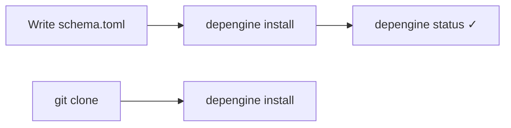

<h1 align="center">depengine</h1>

<p align="center">
  <b>Distro-agnostic dependency installer</b><br>
  Declare the tools you need; depengine selects an available install method.
</p>

<p align="center">
  <a href="https://github.com/Khorea1/depengine/actions"></a>
  <a href="LICENSE"></a>
  
</p>

---

Write a `schema.toml` listing your tools. For each tool, depengine tries the
configured installation methods in order until one succeeds. Methods include
native package managers, cargo, go, pip, git, HTTP downloads, and flatpak.
depengine is a static Go binary with no runtime dependencies.

```sh
depengine init --add "zsh,bat,nvim,ruff"   # → creates schema.toml
depengine validate                          # → ✓ schema is valid
depengine install                           # → 4 installed, 0 failed
depengine status                            # → list what's installed
```

> **Platform support:** Linux and macOS receive the most testing. Windows
> builds support winget, Scoop, Chocolatey, file locking, and state management,
> but the Windows implementation is newer.

## Documentation map

This README covers setup and common workflows. Detailed references:

| Document | What's in it |
|----------|---------------|
| [`docs/schema-reference.md`](docs/schema-reference.md) | `schema.toml` syntax, conditions, buckets, and method control |
| [`docs/cli-reference.md`](docs/cli-reference.md) | Every command and flag, with defaults |
| [`docs/cheatsheet.md`](docs/cheatsheet.md) | Copyable commands, flags, and placeholders |
| [`docs/architecture.md`](docs/architecture.md) | Internal package layout and install flow |
| [`docs/support-boundary.md`](docs/support-boundary.md) | What depengine models, capability/reproducibility limits, scope and source semantics |
| [`docs/security.md`](docs/security.md) | Threat model, arbitrary code, credentials, verification and lockfile expectations |
| [`docs/compatibility.md`](docs/compatibility.md) | Manifest, lock and state format-version policy and v1 freeze status |
| [`docs/depengine.1`](docs/depengine.1) | Man page (`depengine help --man`, or `man depengine` if installed) |
| [`schema/depengine.schema.json`](schema/depengine.schema.json) | JSON Schema for editor autocomplete (taplo, VSCode) |

---

## Your first `schema.toml`

A schema describes **tools** (what you want) and, per tool, **methods** (how
to get it). The engine tries methods in order until one succeeds.

```toml
# schema.toml
schema_version = 1

[tools]

# Package name is the same on every native manager.
simple = ["zsh", "bat", "kitty", "mpv"]

# Package name differs per distro's native manager.
fd = { apt = "fd-find" }   # "fd" everywhere else

# A tool only available through a language ecosystem.
ruff = { python = true }   # expands to pip + pipx + uv, pkg name = "ruff"
```

```sh
depengine validate     # check the schema before touching your system
depengine install      # try every tool's methods in order
depengine status       # see what actually got installed, and how
```

For git builds, verified downloads, platform conditions, and tool dependencies,
see the [schema reference](docs/schema-reference.md).

---

## The sharing workflow

Commit `schema.toml` so each checkout declares the same system tools.



```sh
# --- Project author ---
depengine init --add "zsh,bat,nvim,ruff"
./depengine validate
./depengine install
git add schema.toml depengine.lock && git commit

# --- Everyone else ---
git clone <project> && cd <project>
depengine install                    # same declared tools; locked artifact pins where supported

# --- Optional: pin supported mutable artifact identities ---
./depengine update                   # resolves {latest}, writes depengine.lock
./depengine update --dry-run         # preview what would be pinned
./depengine update --frozen-lockfile # abort if depengine.lock doesn't exist
./depengine install --frozen-lockfile

# `install --dry-run` is planning mode: it may perform read-only resolution
# and availability probes (including network reads), but it does not invoke
# install hooks/adapters, mutate package sources/indexes, write state/lock data,
# or populate the download cache.

# depengine.lock currently pins supported release/artifact placeholders and
# checksums. Package-manager and ecosystem installs are not universally locked
# to concrete versions yet; schema.toml still preserves the declared tool set.

# --- Everyday commands ---
./depengine status                   # what's installed
./depengine status --format=json     # same, machine-readable
./depengine remove nvim              # uninstall
./depengine why nvim                 # explain which method would run, and why
./depengine sbom --format cyclonedx  # export an SBOM
```

> **Note on filenames:** `depengine init` creates `schema.toml` by default.
> `depengine.toml` and `depends.toml` are also auto-detected. This repository's
> examples use `schema.toml`.

---

## `schema.toml` and `manifest.toml`

depengine merges the project schema with a personal manifest, field by field.

| File | Lives in | Purpose | Shared? |
|------|----------|---------|---------|
| `schema.toml` | Project root | **What** to install — the project's dependency list | Yes, commit it |
| `manifest.toml` | `~/.config/depengine/manifest.toml` | **Your personal install catalog** — how you install things, plus personal defaults | No, stays on your machine |

The manifest provides:

1. Installation recipes shared across your local projects, such as per-distro
   package names, candidate methods, and build steps.
2. Machine-specific defaults that fill gaps in the project schema. They do not
   override project declarations.

```sh
cp manifest.example.toml ~/.config/depengine/manifest.toml
# then edit: add your tools, set per-distro package names, define custom methods
```

When you run `install` or `validate`, your manifest merges with the
project's schema. The merge follows these rules:

1. **The schema always wins on conflict.** Your manifest fills in gaps; it
   never overrides what the project declares.
2. **Tools that only exist in your manifest are silently dropped by default**
   — not an error, just excluded from the run. This stops you from
   accidentally injecting a personal tool into a shared project. Opt in with
   `[manifest] allow_new_tools = true`.
3. **A few fields can run arbitrary code** (`pre_install`, `post_install`,
   `build`). Your manifest can set defaults for these, but the
   schema still overrides them.

See [manifest merge rules](docs/schema-reference.md#manifest-merge-rules).

---

## Commands

| Command | Does |
|---------|------|
| `init` | Create a new `schema.toml` |
| `install` | Install all tools from the schema |
| `validate` | Check the schema without installing anything |
| `check <tool>` | Check whether one tool is installed |
| `status` | Show what's installed (all tools; takes no arguments) |
| `remove <tool>` | Uninstall a tool |
| `update` | Resolve `{latest}` placeholders, write `depengine.lock` |
| `upgrade` | Upgrade installed tools to the versions pinned in `depengine.lock` |
| `graph` | Show the dependency graph |
| `why <tool>` | Explain how a tool would be installed |
| `forget <tool>` | Drop a tool from state without touching the system |
| `undo` | Revert the last installation |
| `diff` | Compare two state files |
| `sbom` | Export an SBOM (CycloneDX or SPDX) |
| `completion <shell>` | Generate shell completion scripts |

Every flag and default lives in **[`docs/cli-reference.md`](docs/cli-reference.md)**.

---

## Supported installation methods

| Category | Methods |
|----------|---------|
| **Native** | `native` (auto-detects apt/pacman/dnf/brew/...) + per-manager aliases |
| **Language** | `cargo`, `go`, `pip`, `pipx`, `uv`, `npm`, `pnpm`, `bun`, `gem`, `yarn`, `yarn-berry`, `composer`, `apm` |
| **Desktop** | `flatpak`, `snap`, `vscode`, `vscodium`, `cask` (macOS), `mas` (Mac App Store), `appman` (AppImages) |
| **Windows** | `winget`, `scoop`, `choco`, `msi` |
| **Specialized** | `sdkman`, `steamcmd`, `pacstall`, `aur` (configurable helper), `conda`, `asdf`, `container` (docker/podman pull), `appimage` (portable `.AppImage` under a stable name), `android` (`.apk` via Termux's package installer) |
| **Other** | `git` (clone + build), `github` (recommended for GitHub release assets), `http` (download + extract + checksum) |

Auto-detected native managers, by distro family:

```
debian → apt      fedora  → dnf       suse    → zypper    arch  → pacman
alpine → apk      void    → xbps      gentoo  → emerge    macos → brew
termux → pkg      freebsd → pkg       openbsd → pkg_add   netbsd → pkg
mint   → apt      opkg    → opkg
```

---

## GitHub release assets

Use `github` for binaries published in GitHub Releases. It resolves the real
asset list, accepts common OS/architecture spellings, and pins the release in
`depengine.lock`:

```toml
[tools.yq.github]
repo  = "mikefarah/yq"
asset = "yq_{os_any}_{arch_any}"
```

Both `repo` and `asset` are required. The pattern must match exactly one asset;
depengine reports zero or multiple matches instead of guessing. `github` is the
canonical method name—there is no global `gh` alias.

## Download security

`http` and `github` installs can verify the download with a `checksum` field
inside the method block:

```toml
[tools.yq.github]
repo     = "mikefarah/yq"
asset    = "yq_{os_any}_{arch_any}"
checksum = "sha256:<hex>"          # pinned — verified exactly
```

- `checksum = "sha256:<hex>"` — the download is hashed and compared against
the pinned value; a mismatch rejects the install. Algorithms: `sha256`,
`sha512`, `sha1`, `md5`.
- `checksum = "sha256:auto"` — the expected hash is fetched from a companion
checksum file on first use. This is **TOFU (Trust On First Use)**: the hash
comes from the same server as the binary, so it is **not** verified against
a trusted source (the engine logs a warning and suggests pinning the hash in
`depengine.lock`). Two fields tune `:auto` resolution:
  - `checksum_url` — explicit URL of the checksum file, when you host it
    separately from the download.
  - `checksum_file_format` — layout of that file: `sha256sum` (hash +
    filename), `bsd` (BSD extended), or `raw` (the whole file is the hash).
    Defaults to auto-detection.

Credential-bearing HTTP(S) URLs are rejected. For private GitHub assets, provide
`GITHUB_TOKEN` / `GH_TOKEN` or authenticate `gh`; depengine keeps the token out
of downloader subprocess arguments and sends it only in the HTTP authorization
header.

```toml
[tools.yq.github]
repo                 = "mikefarah/yq"
asset                = "yq_{os_any}_{arch_any}"
checksum             = "sha256:auto"
checksum_url         = "https://example.com/sha256sums.txt"
checksum_file_format = "sha256sum"   # sha256sum | bsd | raw
```

---

## Placeholders

Runtime URL placeholders such as `{arch}`, `{os}`, and `{latest}` may be used
in literal download URLs. GitHub release asset patterns additionally support
`{version}`, `{os_any}`, and `{arch_any}` for matching real asset names:

```toml
yq = { github = { repo = "mikefarah/yq", asset = "yq_{os_any}_{arch_any}" } }
```

Full placeholder and ownership table: [schema-reference.md#placeholders](docs/schema-reference.md#placeholders).

## Editor support

A [JSON Schema](schema/depengine.schema.json) describes `schema.toml`.
Editors with TOML extensions (e.g. [taplo](https://taplo.tamasfe.dev/) for
VSCode) use it for autocomplete, inline validation, and hover docs. Add to
`.vscode/settings.json`:

```json
{
  "taplo.schema.enabled": true,
  "taplo.schema.url": "https://raw.githubusercontent.com/Khorea1/depengine/main/schema/depengine.schema.json"
}
```

## Environment variables

| Variable | Effect |
|----------|--------|
| `DEPENGINE_DETECT_SCRIPT` | Path to `detect_os.sh` (default: next to the binary) |
| `DEPENGINE_MANIFEST` | Path to the personal manifest, overriding XDG discovery |
| `XDG_STATE_HOME` | Base directory for the state file (default: `~/.local/state/depengine/state.json`) |
| `DEPENGINE_TRACE_ID` | Trace ID propagated to subprocesses |
| `DEPENGINE_LOG_JSON` | `=1` enables JSON log output |

---

## Development

See [`docs/architecture.md`](docs/architecture.md) for package layout and
the install flow.

```sh
go test ./...                    # unit tests
go vet ./...                     # static analysis
go build -o depengine .          # build

cd tests/integration && docker compose up --build   # Debian, Arch, Fedora, Alpine
```

## License

[GNU General Public License v3 or later](LICENSE)
