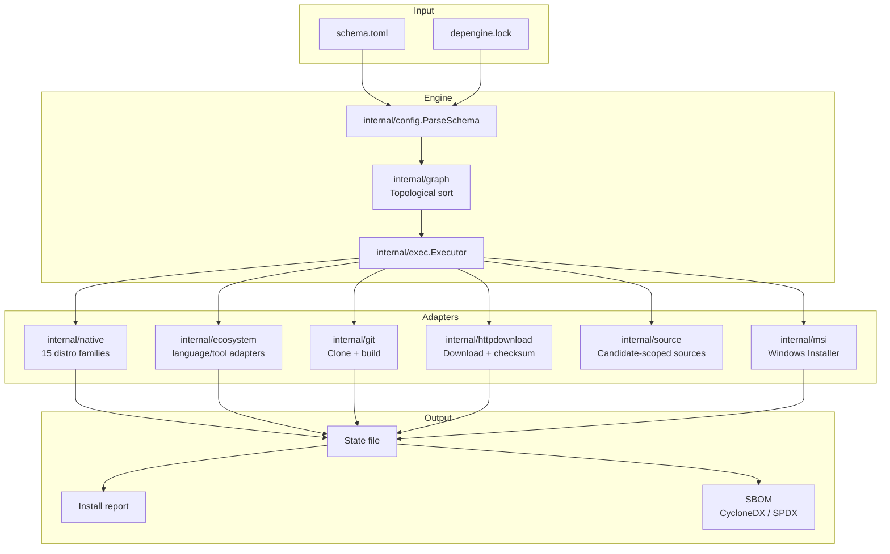
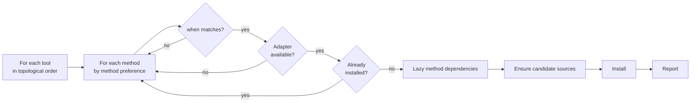

# Architecture

This document describes depengine internals. Usage documentation starts in the
[README](../README.md).



## Package layers

| Package | Responsibility |
|---------|----------------|
| `internal/app` | Cobra command tree and unit-testable CLI application workflows |
| `internal/run` | `Runner` interface — seam for subprocess execution. Production: `OSExecRunner`. Tests: `FakeRunner`. |
| `internal/engine` | Invokes `detect_os.sh` and parses its JSON output; retains compatibility wrappers over platform semantics |
| `internal/platform` | Neutral host facts, distro-family resolution, and host-version comparison shared by parsing and execution |
| `internal/native` | Declarative registry of native package managers per distro clan. Manager lookup, install command building |
| `internal/config` | TOML parser for both `schema.toml` and `manifest.toml` (shared grammar), placeholder expansion, layer merging (`MergeLayers`), kind validation |
| `internal/methodkind` | Compile-time list of known method kind names (ecosystem + native manager aliases). A sanity boundary, not the runtime registry — see `internal/exec.RegisteredKinds()` for that |
| `internal/exec` | Central executor + `Adapter` interface + registry + sync manager + install/report logic |
| `internal/ecosystem` | Language/tool ecosystem adapters (cargo, go, pip, npm, sdkman, steamcmd, ...) |
| `internal/git` | `GitAdapter`: shallow clone + build |
| `internal/httpdownload` | `HTTPAdapter`: download + extraction + checksum/GPG verification + `{latest}` resolution |
| `internal/source` | Idempotent candidate-scoped PPA/COPR/Scoop bucket/Brew tap management |
| `internal/msi` | MSI installation and exact uninstall-registry ownership |
| `internal/graph` | Topological sort (Kahn's algorithm) with cycle detection |
| `internal/lock` | `depengine.lock` — resolves and pins `{latest}` placeholders |
| `internal/state` | Installed-tool state file, with cross-platform file locking (`flock` on Unix, `LockFileEx` on Windows) |
| `internal/log` | Structured logger via `log/slog`, with trace ID and DEBUG–ERROR levels |
| `internal/validate` | Structural + semantic + environmental validation |
| `internal/sbom` | SBOM export (CycloneDX 1.5 / SPDX 2.3) |

## Installation flow



## Contributing

```sh
go test ./...     # unit tests
go vet ./...      # static analysis
go build -o depengine .

cd tests/integration && docker compose up --build   # Debian, Arch, Fedora, Alpine
```
