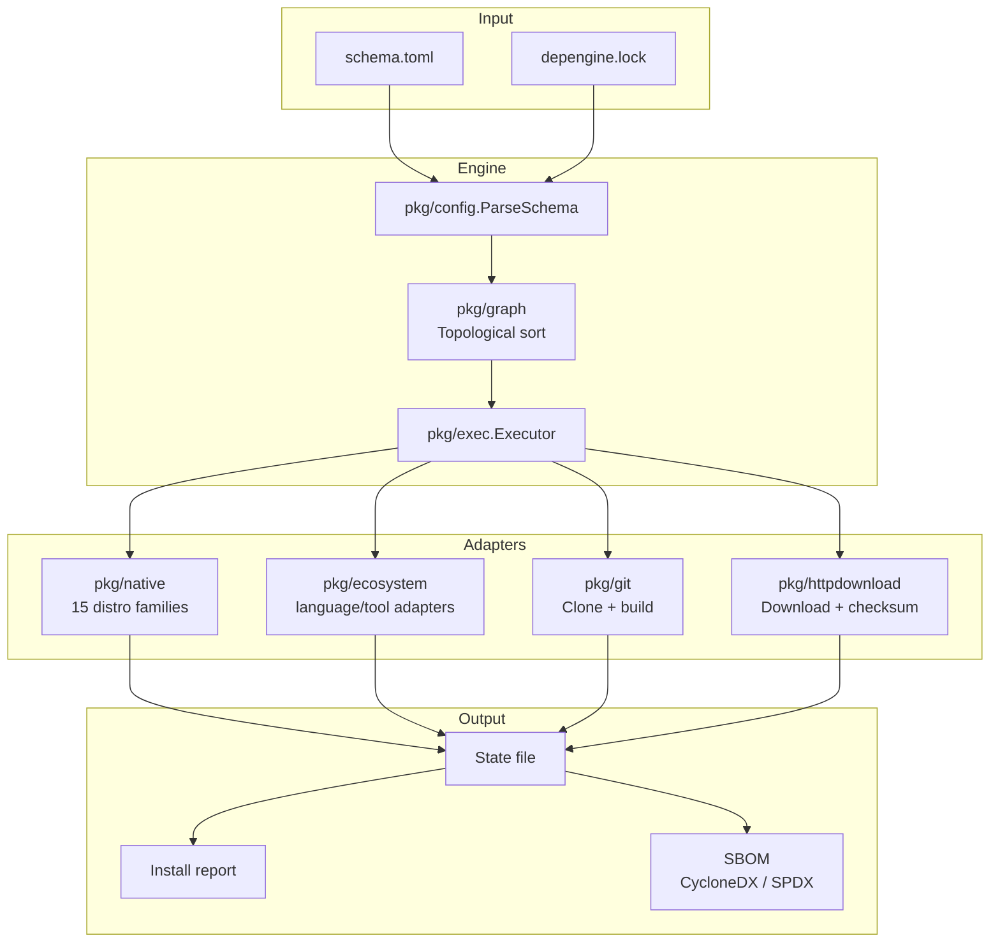
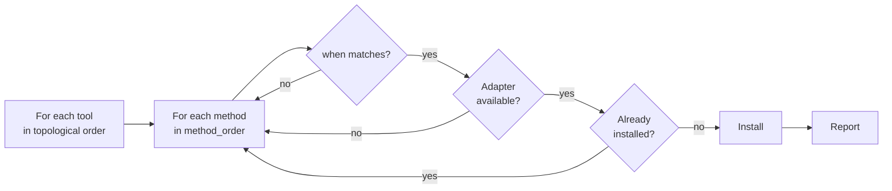

# Architecture

This is internal documentation for contributors. If you just want to use
depengine, you don't need any of this — see [the README](../README.md).



## Package layers

| Package | Responsibility |
|---------|----------------|
| `pkg/run` | `Runner` interface — seam for subprocess execution. Production: `OSExecRunner`. Tests: `FakeRunner`. |
| `pkg/engine` | Invokes `detect_os.sh`, parses its JSON output into `Facts`, resolves the distro clan via `ResolveFamily` |
| `pkg/native` | Declarative registry of native package managers per distro clan. Manager lookup, install command building |
| `pkg/config` | TOML parser for both `schema.toml` and `manifest.toml` (shared grammar), placeholder expansion, layer merging (`MergeLayers`), kind validation |
| `pkg/methodkind` | Compile-time list of known method kind names (ecosystem + native manager aliases). A sanity boundary, not the runtime registry — see `pkg/exec.RegisteredKinds()` for that |
| `pkg/exec` | Central executor + `Adapter` interface + registry + sync manager + install/report logic |
| `pkg/ecosystem` | Language/tool ecosystem adapters (cargo, go, pip, npm, sdkman, steamcmd, ...) |
| `pkg/git` | `GitAdapter`: shallow clone + build |
| `pkg/httpdownload` | `HTTPAdapter`: download + extraction + checksum/GPG verification + `{latest}` resolution |
| `pkg/graph` | Topological sort (Kahn's algorithm) with cycle detection |
| `pkg/lock` | `depengine.lock` — resolves and pins `{latest}` placeholders |
| `pkg/state` | Installed-tool state file, with cross-platform file locking (`flock` on Unix, `LockFileEx` on Windows) |
| `pkg/log` | Structured logger via `log/slog`, with trace ID and DEBUG–ERROR levels |
| `pkg/validate` | Structural + semantic + environmental validation |
| `pkg/sbom` | SBOM export (CycloneDX 1.5 / SPDX 2.3) |

## Installation flow



## Contributing

```sh
go test ./...     # unit tests
go vet ./...      # static analysis
go build -o depengine .

cd tests/integration && docker compose up --build   # Debian, Arch, Fedora, Alpine
```
