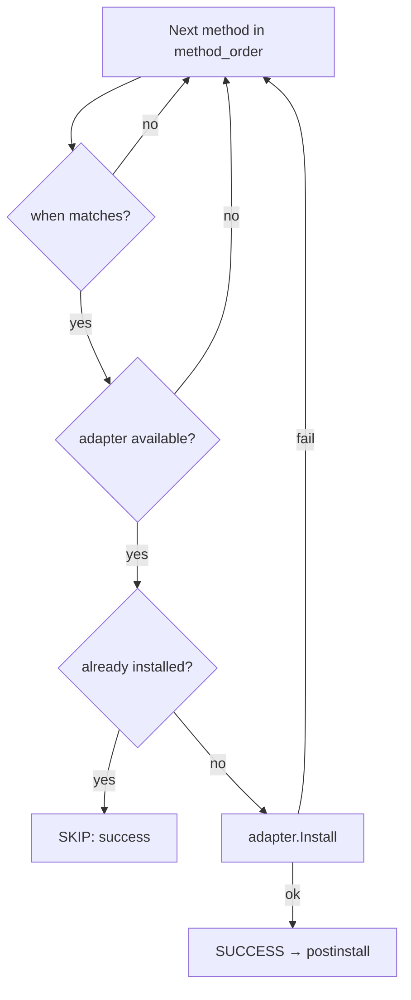

# depengine cheatsheet

Complete reference for `schema.toml`, installation methods, and placeholders.

## Table of Contents

- [Quick CLI Reference](#quick-cli-reference)
- [Schema Structure](#schema-structure)
- [Defaults](#defaults)
- [Tool Declaration Forms](#tool-declaration-forms)
- [Tool-Level Fields](#tool-level-fields)
- [Method Fields](#method-fields)
- [`when` Conditions](#when-conditions)
- [`method_order`](#method-order)
- [`requires`](#requires)
- [`postinstall`](#postinstall)
- [Supported Methods (30)](#supported-methods-30)
  - [native](#native) | [cargo](#cargo) | [go](#go) | [pip](#pip) | [pipx](#pipx) | [uv](#uv) | [npm](#npm) | [pnpm](#pnpm) | [bun](#bun) | [gem](#gem) | [yarn](#yarn) | [yarn-berry](#yarn-berry) | [composer](#composer) | [apm](#apm) | [vscode](#vscode) | [vscodium](#vscodium) | [flatpak](#flatpak) | [snap](#snap) | [cask](#cask) | [mas](#mas) | [sdkman](#sdkman) | [steamcmd](#steamcmd) | [pacstall](#pacstall) | [aur](#aur) | [scoop](#scoop) | [choco](#choco) | [conda](#conda) | [asdf](#asdf) | [git](#git) | [http](#http)
- [Placeholders](#placeholders)

---

## Quick CLI Reference

```sh
depengine install                          # install everything in schema.toml
depengine install --only nvim --verbose    # one tool, detailed output
depengine install --dry-run --sort-by name # preview sorted by name
depengine install --diagnose               # DEBUG + dry-run + verbose
depengine install --json --skip "bat,lsd"  # JSON output, skip tools
depengine install --jobs 4                 # install with 4 concurrent workers
depengine install --allow-arbitrary-code  # suppress build-script security warnings
depengine install --profile=desktop        # only tools tagged "desktop"

depengine validate                         # validate schema.toml
depengine validate --check-env --format json # validate + environment check
depengine validate --strict                # warnings → exit code 1

depengine check nvim                       # is nvim installed?
depengine status                           # tool states vs. state file
depengine status --orphans                # installed tools not in schema

depengine remove bat                       # uninstall bat
depengine remove --all --dry-run           # preview removing everything

depengine version
depengine completion bash | zsh | fish
depengine graph                          # show dependency levels as text

depengine undo                          # revert last install (undo)
depengine undo --list                   # show available snapshots
depengine undo --snapshot <path>        # revert to specific snapshot
depengine graph --format=mermaid         # render as Mermaid flowchart
depengine graph --profile=desktop         # filter by tag
depengine sbom                      # export CycloneDX SBOM
depengine sbom --format=spdx        # export SPDX SBOM

```

---

## Schema vs Manifest

Two files work together:

| File | Location | Purpose | Shared? |
|------|----------|---------|---------|
| `schema.toml` | Project root | **What** to install — the shared dependency list | Yes, commit to git |
| `manifest.toml` | `~/.config/depengine/manifest.toml` | **How** to install — personal package name overrides | No, per-machine |

**Merge rules** (when both define the same tool):
1. Tool-level fields (`requires`, `pre_install`, `postinstall`, `tags`): always from schema.
2. Native method `pkg`: schema wins, **except** when the tool is in `simple = [...]` (auto-injected pkg = tool name) — manifest's pkg overrides.
3. Native `pkg_overrides` (per-manager names): merged — schema keys take priority, manifest fills in missing managers.
4. Non-native methods: if both define the same kind, schema wins; if only manifest has it, it's added.
5. Tools only in manifest are **ignored** — manifest only *augments* schema, never adds new tools.
6. Final method order follows `schema.toml`'s `method_order`.

> Most users never need a manifest. Start with just `schema.toml`.

---
## Schema Structure

```toml
[defaults]          # global defaults (manager, aur_helper, method_order)
[tools]             # all dependencies live here
  simple = [...]    #   shorthand list
  name = { ... }    #   inline table
  [tools.NAME]      #   full block (for complex tools)
    [tools.NAME.method]  # one sub-table per candidate method
```

**Golden rule:** Tool-level fields (`requires`, `pre_install`, `postinstall`) live outside methods.
Method-level fields (`when`, `url`, `build`, `checksum`, `extract_to`, `pkg`, `git`) live inside the method.

---

## Defaults

The `[defaults]` table controls engine-wide behavior.

```toml
[defaults]
manager = "native"             # manager used when a tool specifies nothing
aur_helper = "paru"            # AUR helper binary (paru or yay)
method_order = ["native", "cargo", "go", "pipx", "uv", "pip", "npm", "pnpm",
  "bun", "gem", "yarn", "yarn-berry", "composer", "apm", "vscode",
  "vscodium", "flatpak", "snap", "cask", "mas", "sdkman", "steamcmd",
  "pacstall", "aur", "conda", "asdf", "git", "http"]
```

| Key | Default | Description |
|-----|---------|-------------|
| `manager` | `"native"` | Manager used when a tool is declared via `simple` list — auto-detects the distro's package manager (apt, pacman, dnf, zypper, brew, ...) |
| `aur_helper` | `"paru"` | AUR helper binary to invoke for `aur` method. Also accepts `"yay"`. |
| `method_order` | (see above) | Ordered list of method names tried for every tool. First success wins. |

Omitting `[defaults]` entirely uses all built-in defaults above.

---

## Tool Declaration Forms

### Form 1 — Simple list

Package name equals the tool name everywhere. No per-distro logic needed.

```toml
[tools]
simple = ["zsh", "bat", "kitty", "mpv", "rofi", "w3m", "lsd", "zathura"]
```

### Form 2 — Inline table: package name varies by native manager

Unlisted managers fall back to the tool's own name as the package name.

```toml
fd   = { apt = "fd-find" }
nvim = { pacman = "neovim", apt = "neovim", brew = "neovim" }
hypr = { pacman = "hyprland" }
```

### Form 3 — Inline table: language manager

The value is the package/module name in that ecosystem — may differ from the binary name.

```toml
organize = { pip = "organize-tool", pipx = "organize-tool", uv = "organize-tool" }
fzf      = { go = "github.com/junegunn/fzf" }
lf       = { go = "github.com/gokcehan/lf" }
```

### Form 4 — Inline table: cargo/go with git sub-key

Install from a Git repository instead of the official registry (crates.io / pkg.go.dev).

```toml
matugen    = { cargo = { git = "https://github.com/InioX/matugen" } }
aichat-ng = { cargo = { git = "https://github.com/sigoden/aichat" } }
```

### Form 5 — Full block: multiple methods + `when` + `postinstall`

When the inline table gets too large or you need multiple competing methods with
conditions, promote to a full block.

```toml
[tools.DepartureMono]
postinstall = "fc-cache -fv"

  [tools.DepartureMono.aur]
  pkg  = "otf-departure-mono-nerd"
  when = { distro_family = ["arch"] }

  [tools.DepartureMono.http]
  url        = "https://github.com/ryanoasis/nerd-fonts/releases/download/{latest}/DepartureMono.zip"
  extract_to = "~/.local/share/fonts/DepartureMono"
```

### Form 6 — Ecosystem bucket shorthand

When the package name equals the tool name (~80% of Python/Node cases),
use a **bucket** key instead of repeating the same name for every method.
Buckets expand to all methods in that ecosystem in one go.

**Built-in buckets:**

| Bucket | Expansion | Typical use |
|--------|-----------|-------------|
| `python = true` | `{ pip = true, pipx = true, uv = true }` | Python tools (ruff, httpie, poetry) |
| `node = true` | `{ npm = true, pnpm = true, bun = true }` | Node tools (prettier, eslint, tsx) |

Bucket values accept three shapes:

| Value | Effect | Example |
|-------|--------|---------|
| `true` | Each method uses the tool name as `pkg` | `ruff = { python = true }` |
| `"string"` | Each method gets the string as `pkg` | `organize = { python = "organize-tool" }` |
| `{ pkg = …, when = … }` | Each method gets a clone of the config map | `organize = { python = { pkg = "organize-tool", when = { distro_family = ["arch"] } } }` |

```toml
ruff = { python = true }               # ≡ { pipx = "ruff", uv = "ruff" }
prettier = { node = true }             # ≡ { npm = "prettier", pnpm = "prettier", bun = "prettier" }
organize = { python = "organize-tool" } # ≡ { pip = "organize-tool", pipx = "organize-tool", uv = "organize-tool" }
httpie = { python = true }             # pip + pipx + uv (pkg=httpie on all)
```

> Explicit methods are NOT overridden by the bucket:
> `organize = { pip = "organize-tool", python = true }` keeps `pip` as
> `"organize-tool"` and only expands `pipx`/`uv`.
>
> `python = false` won't expand (the engine treats `python` as an unknown
> method → error on `validate`).

---

## Tool-Level Fields

These live at the `[tools.NAME]` level — they apply regardless of which method ends up being used.
| `requires` | `[string]` | List of tool names that must be installed first. Enforces topological ordering. |
| `pre_install` | `string` | Shell command run before any method execution. If it fails, the tool is aborted. Requires `--allow-arbitrary-code`. |
| `postinstall` | `string` | Shell command run once after any method succeeds for this tool. |
| `tags` | `[string]` | Profile tags for `--profile` filtering (e.g. `["desktop", "server"]`). Tools without tags are always included. |
---

## Method Fields

These live inside each method block (`[tools.NAME.method]` or in their inline table).

| Field | Methods | Description |
|-------|---------|-------------|
| `when` | any | Condition guard. See [`when` conditions](#when-conditions). |
| `pkg` | most | Package name for this manager. Defaults to the tool name. |
| `url` | `git`, `http` | Download/repo URL. |
| `build` | `git` | Shell command executed in the cloned repo directory. |
| `checksum` | `http` | SHA-256 checksum: `"sha256:<hex>"`, `"md5:<hex>"`, `"sha1:<hex>"`, `"sha512:<hex>"`, or `"<algo>:auto"`. |
| `checksum_url` | `http` | Explicit URL for the checksum file (overrides auto URL patterns when `checksum` is `:auto`). |
| `checksum_file_format` | `http` | Format of the checksum file: `"sha256sum"` (default), `"bsd"` (BSD-style), or `"raw"` (file content is the hash). |
| `signature_url` | `http` | URL to GPG detached signature (`.asc`/`.sig`) for verifying the checksum file. |
| `signing_key` | `http` | GPG key URL or fingerprint for signature verification. |
| `extract_to` | `http`, `git` | Destination directory for archive extraction. Default: `/usr/local/bin`. |
| `git` | `cargo` | Sub-key: Git repo URL for `cargo` install instead of crates.io. |
| `branch` | `git` | Git branch or tag to clone. |
| `depth` | `git` | Clone depth — `"1"` for shallow (default), `"0"` for full history. |
| `binary` | `git` | Binary name for check/remove. |

---

## `when` Conditions

A `when` guard lives **inside** a method. If the condition doesn't match the
current system, the engine skips that method and tries the next one in
`method_order`.

```toml
[tools.my-tool.aur]
pkg  = "my-tool"
when = { distro_family = ["arch"] }
```

| Key | Value | Meaning |
|-----|-------|---------|
| `distro_family` | `[string]` | Only attempt this method on the listed distro families. |

Resolved families (15 clans): `debian`, `mint`, `arch`, `fedora`, `suse`,
`alpine`, `void`, `gentoo`, `macos`, `termux`, `freebsd`, `openbsd`,
`netbsd`, `windows`, `opkg`.

---

## `method_order`

Controls the **order** in which candidate methods are tried for each tool.
The engine stops at the first success.

```toml
[defaults]
method_order = ["native", "cargo", "go", "pipx", "uv", "pip", "npm", "pnpm",
  "bun", "gem", "yarn", "yarn-berry", "composer", "apm", "vscode",
  "vscodium", "flatpak", "snap", "cask", "mas", "sdkman", "steamcmd",
  "pacstall", "aur", "conda", "asdf", "git", "http"]
```

**Engine evaluation per method:**



Override the order by listing only the methods you want, in the order you want
them tried.

---
## Per-tool Method Control

Override method order for a single tool:

```toml
myapp  = { method_prefer = ["cargo"], cargo = true }
legacy = { method_only = ["aur", "git"], aur = { pkg = "legacy" } }
```

- **`method_prefer`**: prepends methods before global `method_order`. Unlisted methods still tried as fallbacks.
- **`method_only`**: exact list of methods. Global `method_order` ignored for this tool.
- **`method_order`** (deprecated): old name for `method_prefer`.
- Tool-level fields (same level as `requires`, `tags`, `postinstall`).

---

## `requires`

Declares inter-tool dependencies. The engine resolves a topological order
(Kahn's algorithm) and installs prerequisite tools first. Cycles are detected
and reported as errors.

```toml
zathura-pdf-mupdf = { requires = ["zathura"], pacman = "zathura-pdf-mupdf" }
```

`requires` is tool-level — it applies no matter which method installs the tool.

---

## `postinstall`

A shell command executed once after a method successfully installs the tool.

```toml
[tools.DepartureMono]
postinstall = "fc-cache -fv"
```

Placeholders are expanded in `postinstall` before execution:

```toml
[tools.wezterm]
postinstall = "echo installed on {os}/{arch}"
```

---


## Supported Methods (30)
| Category | Methods |
|----------|---------|
| **Native** | `native` (auto-detect apt/pacman/dnf/brew/...) + per-manager aliases |
| **Language** | `cargo`, `go`, `pip`, `pipx`, `uv`, `npm`, `pnpm`, `bun`, `gem`, `yarn`, `yarn-berry`, `composer`, `apm` |
| **Desktop** | `flatpak`, `snap`, `vscode`, `vscodium`, `cask` (macOS), `mas` (Mac App Store) |
| **Windows** | `scoop`, `choco` |
| **Specialized** | `sdkman`, `steamcmd`, `pacstall`, `aur`, `conda`, `asdf` |
| **Other** | `git` (clone + build), `http` (download + extract + checksum) |

Auto-detects the distro's package manager (15 distros):

| Distro | Manager |
|--------|---------|
| debian, mint | apt (apt-get) |
| arch | pacman |
| fedora | dnf |
| suse | zypper |
| alpine | apk |
| void | xbps |
| gentoo | emerge |
| macos | brew |
| termux | pkg |
| freebsd | pkg |
| openbsd | pkg_add |
| netbsd | pkgin |
| windows | winget |
| opkg | opkg |

```toml
simple = ["zsh", "bat", "kitty"]
fd = { apt = "fd-find" }
nvim = { pacman = "neovim", apt = "neovim" }
```

### cargo

Installs from crates.io (or a Git repo via sub-key).

```toml
ripgrep = { cargo = "ripgrep" }
matugen = { cargo = { git = "https://github.com/InioX/matugen" } }
```

### go

Installs from pkg.go.dev (or a Git repo via sub-key).

```toml
fzf = { go = "github.com/junegunn/fzf" }
lf  = { go = "github.com/gokcehan/lf" }
```

### pip

Python packages via pip.

```toml
organize = { pip = "organize-tool" }
```

### pipx

Python CLI tools in isolated environments.

```toml
organize = { pipx = "organize-tool" }
```

### uv

Fast Python package installer (uv tool).

```toml
organize = { uv = "organize-tool" }
```

### npm

Global npm packages.

```toml
prettier = { npm = "prettier" }
```

### pnpm

Global pnpm packages.

```toml
prettier = { pnpm = "prettier" }
```

### bun

Global bun packages.

```toml
tsx = { bun = "tsx" }
```

### gem

Ruby gems (global).

```toml
sass = { gem = "sass" }
```

### yarn

Global yarn packages.

```toml
typescript = { yarn = "typescript" }
```

### yarn-berry

Yarn Berry (v2+) global packages.

```toml
typescript = { yarn-berry = "typescript" }
```

### composer

Global PHP Composer packages.

```toml
php-cs-fixer = { composer = "friendsofphp/php-cs-fixer" }
```

### apm

Atom package manager (legacy).

```toml
atom-beautify = { apm = "atom-beautify" }
```

### vscode

VS Code extensions.

```toml
golang = { vscode = "golang.go" }
```

### vscodium

VSCodium extensions.

```toml
golang = { vscodium = "golang.go" }
```

### flatpak

Flatpak apps from Flathub.

```toml
spotify = { flatpak = "com.spotify.Client" }
```

### snap

Snap packages.

```toml
hello = { snap = "hello" }
```

### cask

macOS Homebrew casks.

```toml
docker = { cask = "docker" }
```

### mas

Mac App Store apps (by app ID).

```toml
xcode = { mas = "497799835" }
```

### sdkman

SDKMAN! JVM SDKs.

```toml
java17 = { sdkman = "java" }
```

### steamcmd

SteamCMD game server tools.

```toml
cs2 = { steamcmd = "730" }
```

### pacstall

Pacstall packages (Debian-based AUR-like).

```toml
neofetch = { pacstall = "neofetch" }
```

### aur

Arch User Repository (uses configured `aur_helper`).

```toml
google-chrome = { aur = "google-chrome" }

[tools.DepartureMono.aur]
pkg  = "otf-departure-mono-nerd"
when = { distro_family = ["arch"] }
```


### scoop

Windows packages via Scoop (requires Windows).

```toml
git = { scoop = "git" }
```

### choco

Windows packages via Chocolatey (requires Windows).

```toml
firefox = { choco = "firefox" }
```

### conda

Conda packages.

```toml
numpy = { conda = "numpy" }
```

### asdf

asdf version manager plugins.

```toml
nodejs = { asdf = "nodejs" }
```

### git

Clones a repository and runs a build command.

| Field | Required | Description |
|-------|----------|-------------|
| `url` | yes | Git repository URL. |
| `build` | no | Shell command executed in the cloned directory. |
| `extract_to` | no | Directory to copy build artifacts into. |
| `branch` | no | Git branch or tag to clone (default: repository default branch). |
| `depth` | no | Clone depth — `"1"` for shallow (default), `"0"` for full history. Accepted as integer or string. |
| `binary` | no | Binary name for check/remove. When set, `Check()` looks for this binary in PATH. Required for removal from shared directories. |

```toml
ctpv = { git = { url = "https://github.com/NikitaIvanovV/ctpv", build = "make && sudo make install" } }
fasd = { git = { url = "https://github.com/clvv/fasd", build = "PREFIX=$HOME/.local make install" } }
```

### http

Downloads a ready-made artifact (deb, zip, binary), verifies checksum, and
extracts.

| Field | Required | Description |
|-------|----------|-------------|
| `url` | yes | Download URL. Supports `{latest}` (resolved via GitHub API). |
| `checksum` | no | `"sha256:<hex>"` fixed hash or `"sha256:auto"`. |
| `extract_to` | no | Extraction destination. Default: `/usr/local/bin`. |

```toml
fastfetch = { http = {
  url      = "https://github.com/fastfetch-cli/fastfetch/releases/download/{latest}/fastfetch-linux-amd64.deb",
  checksum = "sha256:auto"
} }
```

Archive type is auto-detected from the URL extension: `.tar.gz`, `.tgz`,
`.zip`, `.deb`, `.bin`, or bare binary.

---

## Placeholders

Placeholders are expanded in every string field in the schema before
installation. Unknown placeholders are left untouched (so the validator can
flag them during `depengine validate`).

| Placeholder | Source | Example |
|-------------|--------|---------|
| `{arch}` | `detect_os.sh` | `x86_64`, `aarch64` |
| `{os}` | `detect_os.sh` | `linux`, `darwin` |
| `{distro_family}` | `ResolveFamily` | `debian`, `arch`, `fedora` |
| `{id}` | `detect_os.sh` | `ubuntu`, `arch` |
| `{distro_name}` | `detect_os.sh` | `Ubuntu 24.04 LTS` |
| `{distro_id_like}` | `detect_os.sh` | `debian` |
| `{target_family}` | `detect_os.sh` | `linux` |
| `{kernel}` | `detect_os.sh` | `5.15.0` |
| `{libc}` | `detect_os.sh` | `glibc`, `musl` |
| `{init_system}` | `detect_os.sh` | `systemd`, `openrc` |
| `{detection}` | `detect_os.sh` | `os-release` |
| `{confidence}` | `detect_os.sh` | `high`, `medium` |
| `{is_wsl}` | `detect_os.sh` | `true`, `false` |
| `{is_container}` | `detect_os.sh` | `true`, `false` |
| `{is_android}` | `detect_os.sh` | `true`, `false` |
| `{pkg}` | Substituted by the adapter at install time | package name |
| `{latest}` | Resolved via GitHub releases API (git/http adapters) | `v1.2.3` |

**`{pkg}` and `{latest}` are adapter-owned** — they pass through the schema
parser untouched and are resolved by the adapter at install time. All other
placeholders are populated from `detect_os.sh` facts.

```toml
# {arch} and {os} are expanded from detect_os.sh before installation:
fastfetch = { http = {
  url = "https://example.com/{os}/{arch}/fastfetch-linux-amd64.deb"
} }

# {latest} is resolved by the http adapter via GitHub API:
fastfetch = { http = {
  url = "https://github.com/fastfetch-cli/fastfetch/releases/download/{latest}/fastfetch-linux-amd64.deb"
} }

# {pkg} is substituted by the adapter with the package name:
# (handled internally by the native adapter)
nvim = { pacman = "neovim" }
```

---

## Exit Codes

| Code | Meaning |
|------|---------|
| 0 | Success |
| 1 | Tool install failed, or strict-mode validation found warnings |
| 2 | Schema error (invalid TOML, unknown method, unknown placeholder) |
| 3 | Runtime error (detect_os.sh not found, state I/O failure) |

---

## Environment Variables

| Variable | Effect |
|----------|--------|
| `DEPENGINE_DETECT_SCRIPT` | Path to `detect_os.sh` (default: alongside binary in `scripts/`, then on `PATH`) |
| `DEPENGINE_TRACE_ID` | Trace ID propagated to subprocesses for correlated logging |
| `DEPENGINE_LOG_JSON` | Set to `1` for JSON logger output |
| `XDG_STATE_HOME` | Base directory for state file (`$XDG_STATE_HOME/depengine/state.json`, default `~/.local/state/depengine/state.json`) |
